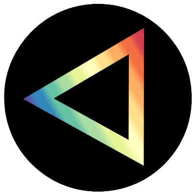

# Welcome to my profile!

👤  **`Name`** Johannes Lövgren

 
💬 **`Lang`** Swedish, English
 
💗 **`Like`** Programming, Cars
 
💼 **`Does`** Self-taught
 

  
⚡ <b><code>Stats</code></b>

  

    
    
     
    
     
    
  

